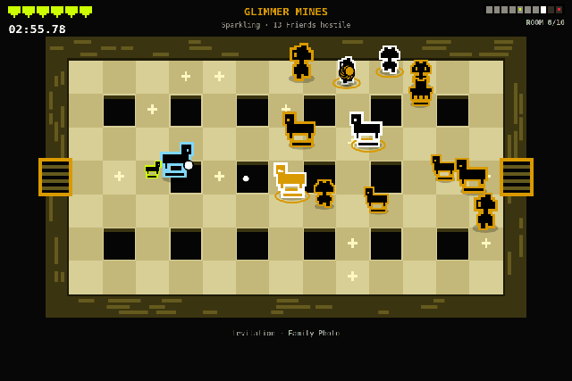

# Daily Crypt



Builder: Fablizio · [GitHub @Fablizio](https://github.com/Fablizio) · [X @FabrizioCottone](https://x.com/FabrizioCottone) · [Telegram @Fablizio](https://t.me/Fablizio) · FriendSDK **v0.1.4** · Rare Friends Vibeathon (**Token Activity**)

A daily time-attack dungeon, the same for everyone. Every ranked attempt costs $RAREFRIENDS: 20% is burned and
80% goes into the day's prize pool, which pays the three fastest verified runs. Your verified Generations Friend
is the runner, and every enemy and boss is a real Rare Friend. **All RF, balances, entries, the pool, the burn
and rival times are simulated in this prototype.** See [ECONOMY.md](ECONOMY.md) for the full economic design.

## Run it

From the repository root (Node.js 22+):

```sh
npm ci
npm run build
npm run dev:game -- games/daily-crypt
```

Open `http://localhost:4173`, connect a wallet on **Robinhood mainnet (4663)** holding a hardwired Generations
Friend (generation ≥ 1) and select it. The SDK runtime handles connection, selection and the fresh ownership
check. No transaction or signature is requested. Static build: `npx friendsdk build games/daily-crypt`.

## Controls

| | Keyboard / mouse | Touch (landscape) |
| --- | --- | --- |
| Move | WASD | Left thumb, anywhere on the left half |
| Shoot | Arrow keys, or hold the left mouse button | Right thumb, anywhere on the right half |
| Power-up choice | 1 / 2 / 3, or click | Tap a card |
| Continue (when offered) | C or Enter to pay, N to end the run | Tap the buttons |
| Pause / mute | P or Esc / M, or the on-screen buttons | On-screen buttons |

Settings and pause include **Mute**, a separate **Music** toggle and **Reduce motion**. The run and its clock pause on blur, hidden tabs, the
pause menu and whenever the runtime opens its own menus.

**Chiptune soundtrack:** lobby theme, family themes per cast, boss variant, jingles; separate Music toggle.
Synthesized with WebAudio (no files): a calm, slightly ominous lobby theme; the cast family's theme in rooms 1–3,
4–5, 6–7 and 8–9; a faster boss variant in room 10; a victory jingle on a clear and a sting on death. It is
silent while paused, hidden, in the pause menu and while the continue offer is open, off when sound is muted, and
starts only after a user gesture. Music runs from the UI layer on wall-clock time and never reads the sim RNG or
touches a tick: `engine/game.ts` did not change and `run-sim.mjs` results are identical.

## Rules

- **One crypt per UTC day, identical for everyone.** It has 10 rooms in a straight line. The rooms, the real Friends in them,
  their spawn points, elites and the power-up offer all come from the day's seed. It resets at 00:00 UTC.
- The route is linear on purpose: with a shared seed, a branching map would reward scouting instead of play.
- Doors open only when the room is empty. Rooms get harder (6 → 14 Friends, elites from room 5, two families mixed
  from room 7).
- **After room 5**, choose 1 of 3 power-ups (the same three for everyone that day). The clock stops while you choose.
- **Room 10 is the boss**: a real Friend at 6× size with four attacks, faster below 60% health. The clock stops
  when it falls.
- **No healing.** Every hit adds **+5 s**. You have **6 guard** (7 for Colossus Friends). The last hit ends the run.
- **Continue, once per attempt.** When your last guard breaks, the clock stops and you get 6 seconds to pay
  **5 RF (100% burned)** for **+2 guard**. The fatal hit still counts (+5 s). Free in Practice.
- **Score = clear time + 5 s × hits.** Lowest wins.
- **Difficulty raised after playtesting.** Compared with the first tuning, regular enemies have +20% HP, elites
  and the boss +25% HP (boss 320 → 400), enemies move 10% faster, fire 15% more often (cooldowns ×0.85) and their
  shots fly 10% faster; the boss enrages at 60% HP instead of 50%. Guard, hit penalty, continue and power-ups are
  unchanged.
- Your Friend's family perk applies (piercing, twin shots, familiar, split shots, wobble, flight, heavy shots,
  bursts, phase skin). The leaderboard shows the family.
- **Generation is prestige only:** a badge, the share line and a free Legendary halo for Gen 1–2. It never changes the run, so ranked play stays fair.
  Your Friend's generation (1 = rarest) is read once from the Generations contract, in the background; a failed
  read just means no badge. Tiers: Gen 1 Legendary, Gen 2 Epic, Gen 3 Rare, Gen 4 Uncommon, Gen 5 Common,
  Gen 6+ Standard. Genesis NFTs are a separate collection that FriendSDK v0.1.4 cannot select as a player.

## Economy (simulated)

| | |
| --- | --- |
| Ranked entry | **10 RF** per attempt, unlimited attempts |
| Burned | **20%** of every entry (2 RF) |
| Day pool | **80%** of every entry (8 RF) |
| Payout at 00:00 UTC | **50% / 30% / 20%** to the three fastest *verified* times |
| Continue (revive) | **5 RF**, once per ranked attempt, **100% burned**, +2 guard |
| Halos (cosmetic) | Ember 20 · Frost 20 · Venom 40 · Gold 80 RF, one-time, **100% burned**, session-only; Legendary: free, Gen 1–2 only |
| Practice | Free, same crypt, never ranked; its continue is free too |
| Starting balance | 100 RF, simulated, per session |

**Protocol 50/50 rule.** The Rare Friends protocol splits activation, hardwire, promote and upgrade payments 50%
burned / 50% RF rewards into Friends' NFT wallets. Daily Crypt entries are a prize-pool game, so 80% funds the
top-3 payouts and 20% burns; continues and halos burn 100%, above the protocol's 50%. ECONOMY.md documents a
protocol-aligned variant (continues and halos 50/50, entries unchanged): 2,825 RF burned plus 825 RF of rewards a
day per 1,000 attempts, versus 3,650 RF burned today.

A dead or forfeited ranked attempt keeps its entry in the pool. Rival entries and times are generated from the
day's seed and labelled **SIMULATED**, and so are their continues (15–30% of the day's entries). Everything resets
on reload (the sandbox has no storage). This prototype
does not use the SDK chance-game actions: entries are a fixed fee, not a chance purchase. The required
`game.json` carries **unused schema-only terms** (1 RF, a single 10,000 bps reward of 1 RF, both
`1000000000000000000` base units).

## Lobby, shop and sharing

- **Burn counter.** The lobby leads with **RF burned today** (simulated), split into entries, continues and halos,
  next to the pool, entries and continues sold.
- **Burn projection.** Pick 100, 1,000 or 10,000 ranked attempts a day to see the burn per day and per 30-day
  month. It adds 2 RF per entry, a 5 RF continue on 25% of attempts and one halo per 100 attempts at the ~40 RF
  average. Those rates are stated assumptions, not data. At 1,000 attempts/day: 3,650 RF/day, 109,500 RF/month.
- **Halo shop.** Four outline colours for your Friend, bought once with simulated RF, 100% burned, equipped for the
  session. Purely visual: `Game.halo` is read only by the renderer, never by the simulation, so it can't affect
  a run or its replay (checked in `run-sim.mjs`). An extra one, **Legendary** (pale gold), is free and unlocked
  automatically for Gen 1 and Gen 2 Friends; everyone else sees it locked ("Gen 1–2 only"). It is never sold, so
  it adds no burn.
- **Generation badge.** Your tier (e.g. `GEN 1 · LEGENDARY`) shows in the lobby, on the result screen and on your
  leaderboard row. Simulated rivals get a display-only generation, drawn from the day's seed after everything
  else so their times don't change.
- **Copy result.** The result screen shows a ready-to-paste line in a selectable text box, e.g.
  `Daily Crypt 2026-09-27 · Friend #25090 (Gen 6) · 3:12.40 (2 hits) · rank #4 · https://fablizio.github.io/daily-crypt/`.
  **Copy result** tries the Clipboard API, then `execCommand("copy")`, and says **Copied ✓** only if one worked.
  If the sandbox blocks both, you select the text yourself.
- **Ghost race (Practice).** **Race ghost** replays your best run of the session (the fastest clear, or else the
  run that got furthest) as a translucent copy of your Friend. It's a second `Game` stepped in lockstep from the
  recorded inputs, power-up and continue. Its enemies are simulated but not drawn. The HUD shows the ghost's room
  and, at each door, how far ahead or behind it is on the clock. The live run never reads the ghost.

## Replay verification (anti-cheat)

The simulation runs at a **fixed 60 Hz step**. All gameplay randomness comes from the day's seed, and cosmetic
randomness uses a separate generator. Each tick's input is recorded as 4 signed bytes (move and aim), plus the
index of the power-up chosen and **the tick of each accepted continue** (`RunRecord.revives`).

When the last guard breaks, the engine raises `reviveOffer` and stops ticking until `revive()` or
`declineRevive()` is called. The replayer (`stepRecorded` in `engine/replay.ts`, shared by verification, Watch
replay and the ghost) accepts the offer only if the next recorded continue has that exact tick, and declines it
otherwise. `verify()` rejects a run if it holds more than one continue, if a recorded continue was never
consumed at a real offer, or if the recomputed status, ticks, hits or continue count differ from the claim.

A finished ranked run is **re-simulated from scratch** from those inputs before it counts. **Watch replay** plays
the recorded inputs back through the same engine. In production this check runs on a server before payouts, and
the server also matches each recorded continue to a paid one (see ECONOMY.md).

## How the Friends are chosen

The day's seed samples 120 token IDs in 1–100,000 (a sampling range: hardwired Friends also exist above it,
e.g. #332833 is a Gen 6) and reads their families from the SDK's pinned sprite registry
(`familyOf`). It groups them into four casts (rooms 1–3, 4–5, 6–7, 8–10) and reads `seedOf` and the canonical
`frames`, using Multicall3 with a fallback to batched reads. Only the public artwork registry is read. The
collection is never scanned and no owners are looked up. The only other read is one `generation(tokenId)` call
for the player's own Friend, for its prestige badge.

## Checks

- `npx friendsdk check games/daily-crypt` and `npx tsc -p games/daily-crypt/tsconfig.json`.
- `node games/daily-crypt/tests/run-sim.mjs`: a bot plays 54 full runs across all nine player families.
  - Two in three honest runs buy the continue when their guard breaks; the rest decline it (17 of 27 revived).
  - Every honest run is recorded and **re-verified by replay: 27/27 match**, including the ones with a continue.
  - **Continue tampering: 68/68 rejected.** For each revived run it tries four edits: hide the continue, move it
    one tick, add a second one, and lie about the count.
  - **Ghost lockstep: 9/9.** A ghost stepped next to a live run matches its record tick for tick. The live run
    is identical with or without the ghost (9/9), and with or without a halo (9/9).
  - Invulnerable, the bot clears the crypt in 19 of 27 runs (22 before the difficulty raise; median clear 269 s,
    was 229 s). The misses are its aim getting stuck behind rocks.
  - With normal guard it dies around room 4 (average room 3.9, was 4.4; deepest room 8). It doesn't dodge, and
    the crypt is meant to be hard.
- `node games/daily-crypt/tests/browser.mjs`: the real SDK runtime in headless Chromium with SDK mock
  fixtures, on desktop and phone layouts, with no browser errors. The desktop pass goes through a full flow:
  - a ranked entry, standing still until the guard breaks, then **Continue · 5 RF** and dying again;
  - it checks the share line and the balance (100 → 85 RF), then **Copy result** (Copied ✓ via the
    `execCommand` fallback in headless Chromium);
  - it checks the `GEN 1 · LEGENDARY` badge (the fixture reports the sample Friend as Gen 1) in the lobby, on the
    result and as `Friend #7730 (Gen 1)` in the share line;
  - it buys and equips the Ember halo, equips the free Legendary halo (no RF spent or burned), sets the projection to 100/day (365 RF/day), then starts **Race ghost**.
- `node games/daily-crypt/tests/run-demo.mjs`: renders `media/demo.gif` from fixed-step frames (test sprites, bot,
  seed 4242), 12 s at 15 fps, 640 px wide, about 1.1 MB.
- Known issue: the stock `npx friendsdk test` fixture only answers artwork reads for sample Friend #7730, so
  it rejects the roster reads by design.

## Limitations

- Cross-browser replay: gameplay uses `Math.sin`/`cos`/`atan2`/`hypot`, which can differ in the last bit between
  JavaScript engines. A run recorded in Safari might not replay bit-exactly in V8. Production verification needs
  fixed-point or table-based math (listed in ECONOMY.md).
- The cast depends on the public Robinhood RPC. If a read fails, the game shows Retry.
- Power-ups that don't fit a family perk (e.g. flight for Hoverers) are skipped, so that family sees the next
  ones in the day's order.
- Ghost: it only covers this session's runs (no storage) and draws only the ghost's Friend. It stops when your run
  ends. Ahead/behind is measured at room entries (clock including hit penalties), not continuously. Racing the
  day's leader would need the leader's input log from a server.
- The continue's 6-second window runs on wall-clock time, not sim time. It pauses with the pause menu, blur and
  runtime menus. Letting it expire counts as **End run**.
- Halos, continues and the burn counter are session-only and simulated, like the rest of the economy.

## Credits

Code, rooms, sound effects and music by Fablizio (AI-assisted). Scenery is drawn in code. Character art: canonical Rare
Friends Generations sprites via the FriendSDK sprite reader. Reward cues come from the FriendSDK sound kit (see
`NOTICE.md`). The engine is shared with the builder's Character Spotlight entry, *The Binding of RareFriend*.
